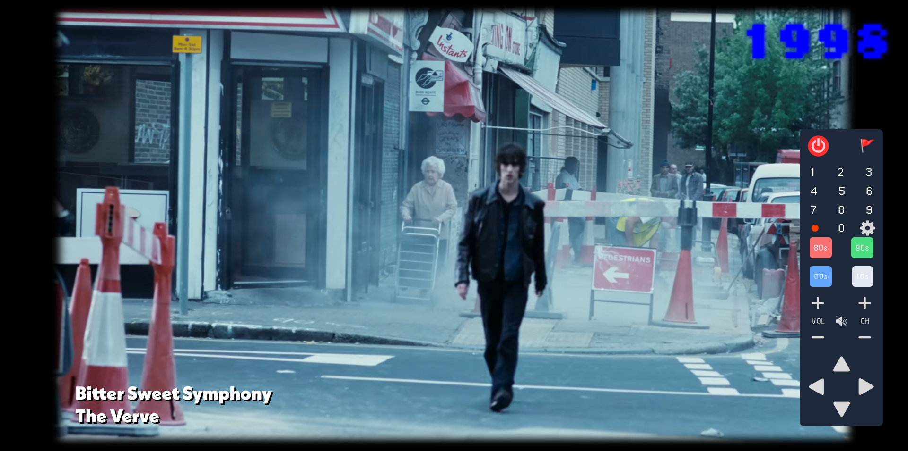
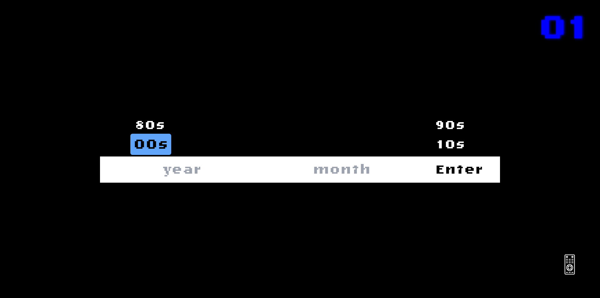

# MVT - Music Video Television

### MVT is an experimental web app that aims to recreate what Music Video Channels would be playing at a specific decade / year / month

<b>Live Demo:</b> <a href="stephend.io">stephend.io</a>

<ul>

<li>
Television UX inspired Billboard Hot 100 archive
</li>
<li>
70000+ songs from 1980 - 2020 hosted on Planetscale (MySQL)
</li>
<li>
Utilized Youtube Data Api to fetch music videos
</li>
<li>
Utilizes Prisma as an ORM, Zod for Type-checking, and React Hook Form for the date input
</li>
<li>
Built with Next.js, Tailwind, and Zustand for state management
</li>

</ul>
